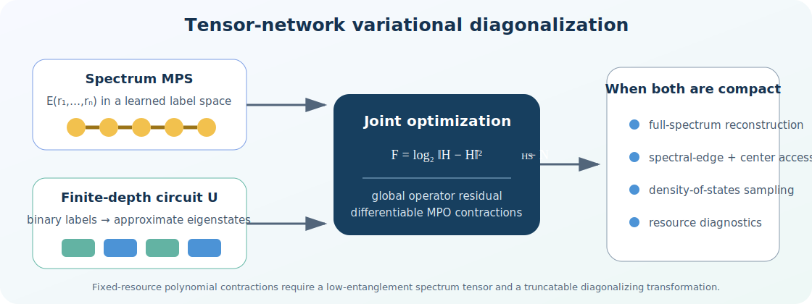
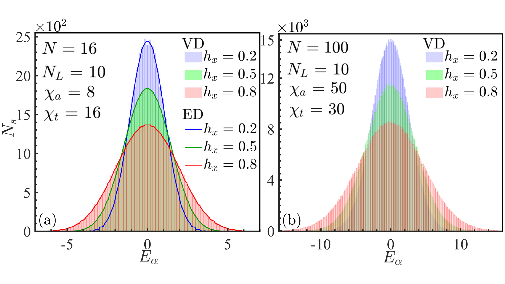
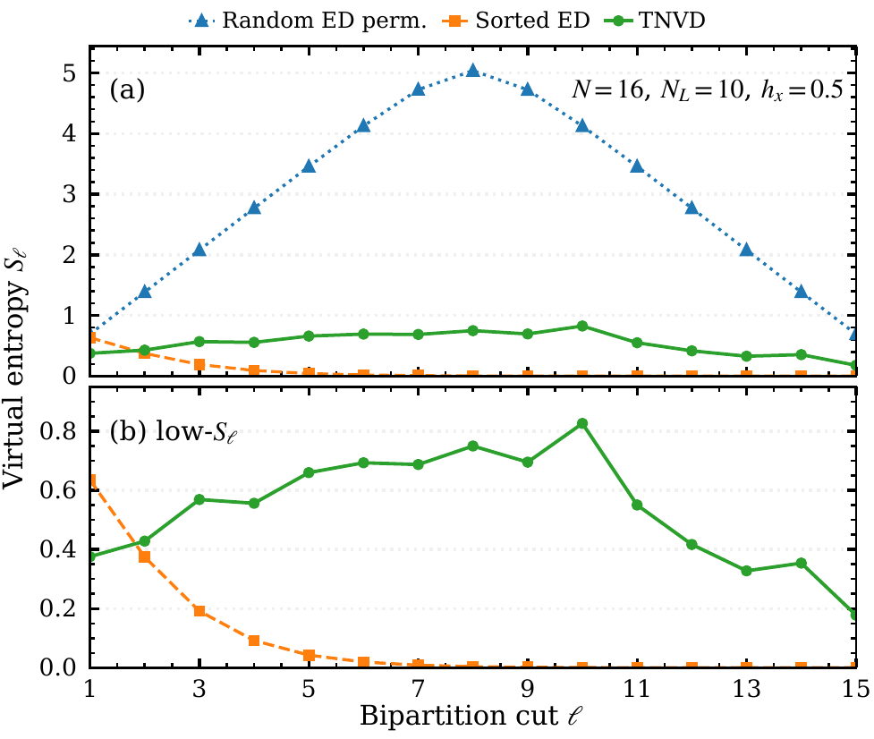

<div align="center">

# Tensor-Network Variational Diagonalization

### A joint tensor-network representation of quantum many-body eigenenergies and eigenstates

[](https://github.com/StudentsZhouPengfei/Tensor-network-variational-diagonalization-of-quantum-many-body-spectra/actions/workflows/ci.yml)
[](https://www.python.org/)
[](https://pytorch.org/)
[](LICENSE)

**[Quick start](#quick-start)** · **[Paper guide](#paper-guide)** · **[Code guide](#code-guide)** · **[Reference tools](#reference-tools-and-data)** · **[Reproducibility](#reproducibility-contract)** · **[Citation](#citation)**

</div>

Tensor-network variational diagonalization (TNVD) asks when a complete many-body spectrum can be accessed without enumerating every eigenpair. It learns two coupled objects: a **spectrum matrix product state (MPS)** that stores eigenenergies in a variational binary label space, and a **finite-depth unitary circuit** that maps those labels to approximate eigenstates.

> **Current release:** a minimally modified, tested packaging of the original TNVD research-code path. The public core retains the working evolution, robust complex-SVD, truncation, layer-growth, alternating-optimization, warm-start, and checkpoint machinery. The only scientific change inside that core is the manuscript loss. MPO generation/loading and the small quickstart are thin outer adapters.

## Quick start

```bash
git clone https://github.com/StudentsZhouPengfei/Tensor-network-variational-diagonalization-of-quantum-many-body-spectra.git
cd Tensor-network-variational-diagonalization-of-quantum-many-body-spectra

python -m venv .venv
source .venv/bin/activate        # Windows: .venv\Scripts\activate
python -m pip install --upgrade pip
python -m pip install -e .

tnvd --quickstart
```

The five-epoch-per-layer CPU quickstart generates its Ising MPO in memory and injects a small configuration into the **original automation engine**. It writes the original per-layer checkpoint files, environment metadata, log, and convergence curves to `results/quickstart/`.

```bash
python -m pip install -e ".[dev]"
pytest                           # physics and end-to-end tests
ruff check .                    # code-quality check
```

## The idea in one picture



For a binary label $r=(r_1,\ldots,r_N)$, TNVD represents the eigenenergy tensor as

$$
E_{r_1\ldots r_N}=\sum_{a_2\ldots a_N}
A^{[1]}_{r_1a_1a_2}\cdots A^{[N]}_{r_Na_Na_{N+1}},
\qquad a_1=a_{N+1}=1,
$$

and associates it with $|\alpha\rangle=U|r_\alpha\rangle$. Joint optimization learns the labels instead of imposing a sorted-energy ordering. The three controlling resources are:

| Resource | Meaning | Code/CLI |
|---|---|---|
| $\chi_a$ | spectrum-MPS storage and virtual entanglement | `--spectrum-bond` |
| $N_L$ | circuit expressiveness | `--layers` |
| $\chi_t$ | Schmidt truncation of the circuit-evolved MPO | `--mpo-cutoff` |

At fixed $\chi_a$, $N_L$, and $\chi_t$, the contractions are polynomial in $N$. This is a conditional fixed-resource statement—not a claim that arbitrary spectra can be exactly compressed.

## Paper guide

### What is new?

Earlier unitary tensor-network approaches primarily represent selected eigenstates, approximate eigenbases, conserved structures, or diagonalizing transformations. TNVD adds an **explicit MPS for the exponentially long energy tensor** and optimizes it together with the circuit in one learned label space. This enables direct spectrum-MPS sampling after training.

The scientific criterion is **joint compressibility**:

- the learned energy tensor must have sufficiently low virtual entanglement;
- the corresponding diagonalizing transformation must remain truncatable at finite Schmidt rank.

TNVD therefore turns full-spectrum access into a test of learnable tensor structure rather than assuming every local Hamiltonian has a compact full-spectrum representation.

### Main results at a glance

| Manuscript result | Representative data | Physical conclusion |
|---|---|---|
| **Full-spectrum Ising reconstruction** | $6\le N\le100$; ED comparison for $N\le16$; displayed edge-to-center errors are $O(10^{-2})$ or below | One TNVD representation covers both the spectral edge and dense center instead of targeting a single window |
| **Spectrum-MPS resource scaling** | At the studied circuit resources, the loss saturates above roughly $\chi_a\simeq16$ | The Ising energy tensor admits a compact MPS representation in the learned labels for this benchmark |
| **Density of states beyond enumeration** | An MPS encodes $2^{100}$ levels; $10^6$ labels are sampled with per-sample cost $O(N\chi_a^2)$ | Global spectral statistics can be estimated without forming or sorting the complete spectrum |
| **Quantitative DOS validation** | At $N=16$, ED/TNVD Gaussian widths are $(1.069/1.068)$, $(1.426/1.425)$, and $(1.910/1.908)$ for $h_x=0.2,0.5,0.8$ | Spectrum-MPS sampling agrees with an exact reference where enumeration remains possible |
| **Random-label control** | A random permutation of the same exact energies produces a large middle-cut spectrum-state entropy | Energy amplitudes alone are insufficient; label organization is an essential compression resource |
| **Matched Ising–XXZ comparison** | $N=14$, $N_L=10$, $\chi_a=16$, $\chi_t=48$; similar Poisson–GOE-like–localized crossovers but different TNVD errors | Spectral chaos or level repulsion alone does not determine TNVD difficulty |
| **Finite-rank bottleneck** | At $\chi_s=8$, XXZ discarded weight is about one order larger; at $\chi_s=16$, several orders larger. Fitted ground-state tail exponents: $\alpha_{\rm XXZ}\simeq0.893$, $\alpha_{\rm Ising}\simeq1.735$ | Slower Schmidt decay explains why XXZ is harder at matched tensor resources |

These are manuscript-level results, not outputs promised by the small quickstart.

### From exact validation to large-spectrum sampling



**Main-text DOS benchmark—density of states without full enumeration.** At $N=16$ (left), histograms sampled from the learned spectrum MPS agree with exact-diagonalization curves for three transverse fields. At $N=100$ (right), the same representation provides access to a spectrum containing $2^{100}$ levels through label sampling rather than explicit construction. The displayed large-system histogram is a statistical estimate of the density of states, not a listing of every eigenvalue.

### The essential label-organization control



**Supplementary control—same energies, different binary organization.** The figure uses $N=16$, $N_L=10$, and $h_x=0.5$. The blue curve randomly permutes the binary labels of the same exact ED energies; it preserves every energy amplitude and the density of states, but produces a large middle-cut virtual entropy. Sorted ED (orange) is an exact low-entanglement reference under explicit energy ordering. TNVD (green) is **not sorted**: it realizes a low-entanglement approximate spectrum in the label space learned jointly with the circuit. Panel (b) resolves the low-entropy curves.

This control directly answers the random-spectrum concern: the energy distribution alone is not what makes the spectrum MPS compact. Label organization is an essential resource. It does not claim that every exact many-body spectrum necessarily admits a compact TNVD labeling.

### Questions raised during peer review

<details>
<summary><strong>Can an arbitrary random spectrum be compressed as an MPS?</strong></summary>

No. A generic list of $2^N$ random values generally requires exponentially growing bond dimension. The random-label control preserves the exact energy amplitudes while scrambling their binary assignment; its much larger virtual entropy shows why label organization is necessary. TNVD tests for a compact learned organization—it does not assume one always exists.

</details>

<details>
<summary><strong>Is the transverse-field Ising model too easy to establish the method?</strong></summary>

The clean transverse-field chain is deliberately used as an exactly solvable validation reference. The interacting stress test is the random-field XXZ chain. In the manuscript's disorder comparison, a nonzero longitudinal random field also generically breaks the clean Ising free-fermion integrability, so the comparison is not simply “solvable Ising versus interacting XXZ.”

</details>

<details>
<summary><strong>Does level repulsion determine spectrum-MPS complexity?</strong></summary>

Not by itself. Level statistics probe correlations after energy ordering, whereas spectrum-MPS complexity probes bipartite correlations in a variational binary label space. Similar level-statistics crossovers coexist with sharply different TNVD errors in Ising and XXZ. For XXZ, the spacing ratio is evaluated in the zero-magnetization sector using its central $50\%$, avoiding mixed-sector artifacts.

</details>

<details>
<summary><strong>Are spectrum-state entanglement and eigenstate entanglement the same?</strong></summary>

No. Spectrum-state virtual entanglement is defined along the binary energy-label chain and diagnoses the MPS resources needed to encode $E_r$. Eigenstate entanglement is a physical-space property of $|\alpha\rangle$. The manuscript uses them as distinct diagnostics.

</details>

<details>
<summary><strong>Is TNVD intended for precision ground-state spectroscopy?</strong></summary>

No. At the reported resources, TNVD is not a replacement for specialized ground-state or few-level solvers. Its target is a compressed full-spectrum representation and global spectral observables. Low-lying levels are shown to establish that the same representation covers the spectral edge and center, not to claim state-of-the-art low-energy precision.

</details>

## Paper loss

The implementation optimizes the manuscript's logarithmic Hilbert–Schmidt objective:

$$
F=\log_2\left\|H-\widetilde H\right\|_{\mathrm{HS}}^2-N,
$$

$$
\left\|H-\widetilde H\right\|_{\mathrm{HS}}^2
=\mathrm{Tr}(H^\dagger H)-2\,\mathrm{Re}\,\mathrm{Tr}(H^\dagger\widetilde H)
+\mathrm{Tr}(\widetilde H^\dagger\widetilde H).
$$

The optimized quantity is `log2(residual_squared) - N`. It is **not** the square root of the Hilbert–Schmidt residual used by the older experiment-directory name. Because this global operator residual traces over the full Hilbert space, it does not privilege a selected energy window.

## Code guide

### Configurable run

```bash
tnvd \
  --spins 8 \
  --field-x 0.5 \
  --layers 2 \
  --spectrum-bond 8 \
  --mpo-cutoff 16 \
  --epochs 200 \
  --seed 7 \
  --output results/n8
```

`quickstart_config.json` records the overlaid configuration, source MPO, random seed, invocation, Python/PyTorch versions, platform, and CUDA version. For paper-scale runs, edit the preserved [`config.py`](src/tnvd/config.py) and run `python -m tnvd.run_automation`; this retains the original warm-start and per-layer checkpoint workflow.

### Use an existing MPO

```bash
tnvd \
  --mpo-file path/to/hamiltonian_mpo.pth \
  --spins 14 \
  --spectrum-bond 16 \
  --mpo-cutoff 48 \
  --output results/from_mpo
```

The file must contain a list of rank-4 PyTorch tensors with index order

```text
(left virtual bond, bra physical index, ket physical index, right virtual bond).
```

The loader validates site count, spin-$1/2$ physical dimensions, open boundaries, and neighbouring virtual bonds. Load `.pt`/`.pth` files only from trusted sources because PyTorch checkpoints may contain pickled objects.

### Generate an XXZ MPO with AutoMPO

```python
from tnvd.autompo_models import autompo_random_field_xxz
from tnvd.mpo_factory import save_mpo

fields = [0.2, -0.1, 0.05, -0.15, 0.08, -0.12]
mpo = autompo_random_field_xxz(6, longitudinal_fields=fields)
save_mpo(mpo, "random_field_xxz_n6.pth")
```

The lightweight finite-state-automaton core is vendored from
[Hao-Kai Zhang's AutoMPO](https://github.com/Haokai-Zhang/AutoMPO) and converts
its output to the TNVD tensor convention. The exact upstream commit, supplied
operator-pool extension, and licensing status are recorded in
[THIRD_PARTY_NOTICES.md](THIRD_PARTY_NOTICES.md).

### Architecture

```text
src/tnvd/
├── class_evolve_TNO_cut_dims.py  original evolution/SVD/truncation engine
├── tn_utils.py                   original tensors, contractions, warm starts
├── run_automation.py             original layer-growth and optimization loop
├── config.py                     preserved paper-scale configuration example
├── mpo_factory.py                new generated/existing-MPO adapter
├── autompo_models.py             FSA-based TFIM/XXZ MPO adapters
├── exact_diagonalization.py      small-system exact references
├── _vendor/autompo/              lightweight attributed AutoMPO core
└── quickstart.py                 new small config overlay; calls original engine
```

This layout follows a **stable core + thin adapters** rule. New Hamiltonians should connect through an MPO or configuration rather than replace the working tensor kernels. The exact core provenance and minimal public diff are documented in [ORIGINAL_CORE.md](docs/ORIGINAL_CORE.md). See also the [architecture guide](docs/ARCHITECTURE.md) and [maintainer/Codex guide](AGENTS.md).

## Reference tools and data

The repository now includes small-system references distilled from the original
ED and analysis scripts:

```bash
# Full TFIM spectrum
python tools/exact_diagonalization.py tfim --spins 8 --field-x 0.5

# Fixed-magnetization XXZ block and central-50% adjacent-gap ratio
python tools/exact_diagonalization.py xxz --spins 10 --sector 5

# Replot the bundled Schmidt-resource tables
python analysis/plot_schmidt_resources.py --output results/schmidt-resources.png
```

[`data/`](data/README.md) contains human-readable tables for the matched
Ising–XXZ benchmark, discarded Schmidt weights, and ground-state Schmidt tails.
[`analysis/spectrum_label_control.py`](analysis/spectrum_label_control.py)
recomputes the random-permuted/sorted-ED virtual-entanglement control from energy
vectors. Large eigenvector matrices and training checkpoints remain external.

## Reproducibility contract

| Level | What this repository currently provides |
|---|---|
| **Install** | Standard `pyproject.toml`, Python 3.9/3.11 CI, Apache-2.0 license |
| **Verify** | Dense/MPO equality, direct/AutoMPO agreement, XXZ sector ED, manuscript-loss, external-MPO, and original-engine end-to-end tests |
| **Run** | Deterministic self-contained Ising quickstart through the research execution path |
| **Reuse existing data** | Original per-layer checkpoint names, warm-start structure, and MPO tensor convention |
| **Extend** | Thin configuration and validated MPO adapters; Codex guidance that protects the core |
| **Reproduce manuscript analyses** | Selected ED, label-control, Schmidt-resource scripts and lightweight tables are bundled; full figure-by-figure reproduction still requires paper-scale presets and checkpoints |

For scientific use, verify a small system against exact diagonalization before scaling. Increase $N$, $N_L$, $\chi_a$, and $\chi_t$ independently and report all three tensor resources. A single fixed-resource run is not a convergence study.

### Numerical notes

- The logarithm receives a machine-scale positive clamp before evaluation.
- The original robust complex SVD, gauge-gradient hooks, singularity escape, alternating optimization, layer growth, and warm-start assembly are retained.
- A programmatic XXZ AutoMPO adapter is included; CLI paper presets, direct spectrum-MPS sampling, and complete figure-by-figure workflows remain future packaging work.
- Small tests establish implementation consistency, not asymptotic convergence for arbitrary Hamiltonians.

## Scientific context

TNVD builds on MPS/TEBD methods and unitary tensor-network descriptions of spectral structure. Directly relevant background includes:

- F. Pollmann *et al.*, [Phys. Rev. B **94**, 041116 (2016)](https://doi.org/10.1103/PhysRevB.94.041116).
- T. B. Wahl, A. Pal, and S. H. Simon, [Phys. Rev. X **7**, 021018 (2017)](https://doi.org/10.1103/PhysRevX.7.021018).
- R. Haghshenas, [Phys. Rev. Research **3**, 023148 (2021)](https://doi.org/10.1103/PhysRevResearch.3.023148).
- J. I. Cirac *et al.*, [Rev. Mod. Phys. **93**, 045003 (2021)](https://doi.org/10.1103/RevModPhys.93.045003).
- P.-F. Zhou *et al.*, [Phys. Rev. Lett. **131**, 020403 (2023)](https://doi.org/10.1103/PhysRevLett.131.020403).

These works provide context; this repository does not claim that tensor-network circuits for spectral problems originated with TNVD. The specific contribution here is the jointly optimized spectrum MPS, learned labels, and diagonalizing circuit.

## Citation

**Accompanying manuscript**

> Peng-Fei Zhou, Shuang Qiao, An-Chun Ji, and Shi-Ju Ran, “Tensor-network variational diagonalization of quantum many-body spectra” (2026). Publication metadata will be added when publicly available.

Until then, use [CITATION.cff](CITATION.cff) or:

```bibtex
@software{TNVDGitHub2026,
  author = {Zhou, Peng-Fei and Qiao, Shuang and Ji, An-Chun and Ran, Shi-Ju},
  title = {Tensor-network variational diagonalization of quantum many-body spectra},
  year = {2026},
  url = {https://github.com/StudentsZhouPengfei/Tensor-network-variational-diagonalization-of-quantum-many-body-spectra}
}
```

Bug reports and reproducibility questions are welcome through GitHub Issues. Contributions should preserve the paper loss and tensor-index conventions and include a focused test.

## License

Original TNVD code is released under Apache License 2.0; see [LICENSE](LICENSE).
Vendored third-party material is documented separately in
[THIRD_PARTY_NOTICES.md](THIRD_PARTY_NOTICES.md).
